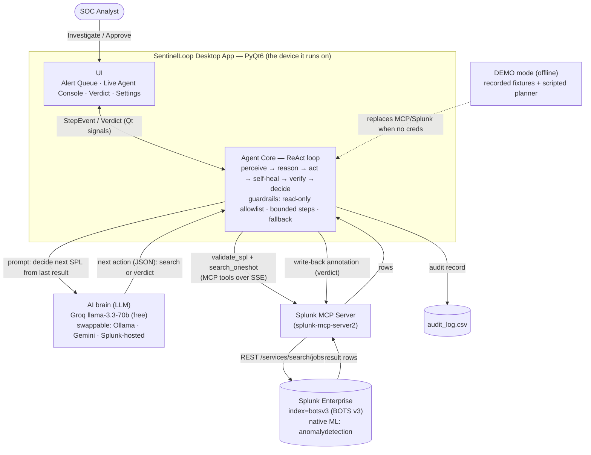

# SentinelLoop — Architecture

How the autonomous SOC-triage agent works end to end: how it talks to Splunk, how the
AI agent/models are integrated, and how data flows between the services.

## 1. How the application interacts with Splunk
- **All SPL runs through the Splunk MCP Server.** The agent calls the MCP tools
  `validate_spl` (risk-check every query *before* running it) and `search_oneshot`
  (execute it) over SSE. The MCP server in turn calls Splunk's REST
  `/services/search/jobs` API. If the MCP server is unavailable, the app falls back to
  calling Splunk REST directly (`LiveSplunk`).
- **Alerts** in the queue are generated by curated detections that run as SPL over
  `index=botsv3` (the BOTS v3 dataset) — there is no Enterprise Security/`notable` index.
- **Write-back:** the approved verdict is written back to Splunk as an annotation, and an
  audit record is appended to `audit_log.csv` — both gated by a human **Approve**.

## 2. How the AI models / agents are integrated
- **Autonomous LLM agent (ReAct loop).** An LLM (Groq `llama-3.3-70b-versatile` by
  default; provider-agnostic via three `LLM_*` env vars — Ollama, Gemini, OpenAI, or a
  Splunk-hosted model) **decides each next SPL query from the previous result**, then
  returns a MITRE ATT&CK-mapped verdict. It is a multi-step agent, not a single prompt.
- **Splunk-native ML.** During the investigation the agent runs Splunk's own
  `anomalydetection` command to surface statistical outlier hosts.
- **Schema-drift self-healing.** When a query references a field that no longer exists on
  a sourcetype (so it silently returns nothing), the agent detects the drift and rewrites
  the query to the current field — the failure mode that breaks brittle dashboards.
- **Safety:** every AI-generated query is validated via the MCP `validate_spl` tool,
  constrained to a read-only `index=botsv3` allowlist, bounded to a step budget, and
  falls back to a deterministic planner if the model errors. No action is auto-executed —
  the human approves.

## 3. Data flow between services, APIs, and components
1. **Perceive:** detections (SPL over `index=botsv3`) → alert queue in the UI.
2. **Reason:** Agent Core sends the alert + history to the **LLM**, which returns the next
   action.
3. **Act:** Agent → **MCP Server** (`validate_spl` → `search_oneshot`) → **Splunk REST** →
   rows flow back the same path.
4. **Verify/decide:** the agent loops (step 2–3) until it has enough, then produces a
   verdict (severity, confidence, MITRE, narrative).
5. **Stream:** every thought/query/result is emitted as a `StepEvent` to the UI live (on a
   background `QThread`, so the UI never blocks).
6. **Act on verdict (human-gated):** on **Approve** → annotation written back to Splunk +
   audit row to CSV.

**DEMO mode** swaps the Splunk/MCP layer for recorded JSON fixtures and a scripted planner,
so the whole experience (including the drift-heal) runs fully offline with zero setup —
this is what the bundled `SentinelLoop.exe` ships.

See [`docs/ARCHITECTURE.md`](docs/ARCHITECTURE.md) for the component/file-level breakdown.
